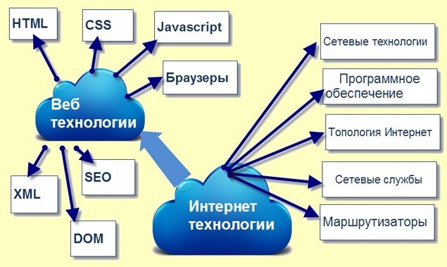

# Дипломная работа курса «Frontend разработчика»

# **Тема проекта**: Проектирование и разработка web-сайта с использованием (под вопросом - Bootstrap) Framework
## **Цель**: Изучить особенности разработки веб-сайта с использованием различных инстурментов, а так же изучить вопрос адаптивной верстки и валидности сайта. 

### **Задачи**:   

1. Изучить литературу, касающуюся темы исследования;    

2. Рассмотреть основные виды и методы  веб-разработки; 

3. С проектировать и ознакомиться с основными методами разработки web-сайта, а так же его оптимизации;

4. Изучить вопрос валидности и кросбраузерности; 

5. Выполнить адаптивность разработанного проекта, по эталону устройств;  

### **Инструменты**: HTML5, CSS3, JavaScript и Bootstrap, Git, Photoshop, Figma.   

### **Структура дипломного проекта**:   

_Оглавление_  

_Введение_ 

**Глава 1. ТЕОРЕТИЧЕСКИЕ ВОПРОСЫ РАЗРАБОТКИ ВЕБ-САЙТОВ (~15 стр)**  

1.1 Интернет технологии

1.2 Хостинг и домен  

1.3 Классификация web-сайтов

1.4 Веб-программирование

**Глава 2. РАЗРАБОТКА И ВНЕДРЕНИЕ ВЕБ-САЙТА (НАЗВАНИЕ) (~15 стр)**  

2.1 Описание проекта

2.2 Выбор программного обеспечения 

2.3 Структурная и функциональная схемы веб-сайта

2.4 Проектирование веб-сайта 

2.5 Оптимизация веб-сайта 

**Глава 3. Основные фукнции и особенности web-сайта (НАЗВАНИЕ) (~20 стр)** 

3.1 Основной функционал  

3.2 Выбор интерфейса   

3.3 Адаптивность под разные устройства  
   
3.4 Подведение итогов. 

_Заключение (~ 4 стр)_ 

_Список используемой литературы_ 

_Приложения_

### **Оглавление**
------------------
------------------
------------------
### **Введение**

   Интернет – всемирная сеть, которая объединяет множество компьютерных сетей различного уровня и отдельных компьютеров, обменивающих друг с другом информацией по каналам общественных телекоммуникаций на базе протоколов связи TCP/IP. Информация в Интернет хранится на серверах. Серверы, объединенные высокоскоростными магистралями, составляют базовую часть сети Интернет. Доступ пользователей к информационным ресурсам Интернет обычно осуществляется через провайдеров или корпоративную сеть. На сегодняшний день количество пользователей Интернет стремительно растет. По данным на июнь 2023 года, количество пользователей посещающих Интернет, насчитывает
8,1 миллиарда человек.

	Первый в мире сайт info.cern.ch появился 6 августа 1991 года. Его создатель, Тим Бернерс-Ли, опубликовал на нём описание новой технологии World Wide Web, основанной на протоколе передачи данных HTTP, системе адресации URI и языке гипертекстовой разметки HTML. Также на сайте были описаны принципы установки и работы серверов и браузеров. Сайт стал и первым в мире интернет-каталогом, так как позже Тим Бернерс-Ли разместил на нём список ссылок на другие сайты.
	Все инструменты, необходимые для работы первого сайта, Бернерс-Ли подготовил ещё раньше — в конце 1990 года появились первый гипертекстовый браузер WorldWideWeb с функционалом веб-редактора, первый сервер на базе NeXTcube и первые веб-страницы. 
   Создание и совершенствование компьютеров привело и продолжает приводить к созданию новых технологий в различных сферах научной и практической деятельности. Одно из важнейших достижений человечества является Интернет, способный связывать миллионы компьютеров по всему миру. На сегодняшний день, Интернет содержит около 612 миллионов сайтов, содержащий информацию во всех областях.

### **Разработка сайта делится на три этапа:**

**Разработка дизайна**
	Веб-дизайнеры разрабатывают макеты веб-шаблонов страниц. Дизайнер определяет, каким образом конечный потребитель будет получать доступ к информации и услугам сайта — то есть, занимается непосредственно разработкой пользовательского интерфейса. В большинстве случаев страницы включают в себя графические элементы. Их подготовкой занимаются художники, иллюстраторы, фотографы, технические дизайнеры, шрифтовики, и т. д. Готовые шаблоны показываются заказчику. В этот момент страницы ещё не могут содержать конечного наполнения (это в обязанности дизайнера не входит). Чтобы макеты выглядели более наглядно, в них помещается произвольное содержимое. На сленге дизайнеров такое содержимое называется рыбой. Если заказчик удовлетворён внешним видом шаблонов, то наступает следующая фаза разработки — вёрстка страниц сайта.

**Вёрстка**
   Верстальщик получает макеты шаблонов в виде простых изображений (например, в формате JPEG или PNG), либо разбитых по слоям (например, в PSD или AI). Его задача — получить из этих графических макетов гипертекстовые веб-страницы с подготовленными для интернета изображениями.
   Одним из сложных моментов в работе верстальщика является обеспечение совместимости со множеством браузеров — программами для просмотра веб-страниц (так называемая кроссбраузерность). Браузеры могут одни и те же элементы разметки или правила CSS интерпретировать по-своему, в результате чего некоторые пользователи могут увидеть содержимое не так, как задумывал дизайнер и ожидает увидеть заказчик. Когда верстальщик убедится, что большинство браузеров одинаково отображают готовые шаблоны, наступает следующая фаза разработки — веб-программирование.

**Программирование**
	К программистам поступают готовые шаблоны страниц и указания дизайнеров по работе и организации элементов сайта. Программист создаёт программную основу сайта, делая её с нуля, используя фреймворк или CMS. Выбор языка программирования в данном случае — вопрос непринципиальный.
	После того, как сайт готов к эксплуатации, наступает следующая фаза — наполнение сайта информацией.

### **Глава 1. ТЕОРЕТИЧЕСКИЕ ВОПРОСЫ РАЗРАБОТКИ ВЕБ-САЙТОВ**

**1.1 Интернет технологии**

Прежде всего, все многообразие сайтов, плюс чаты, форумы, электронная почта, Интернет торговля (включая Интернет магазины), социальные сети и масса всего, что создано для работы в Интернет или с использованием Интернет. Интернет технологии создаются по определенным методам в соответствии с определенными правилами при помощи специальных технических средств (сетей, серверов и т.п.) и специальных программ.

**Нам как frontend-разработчику нужны будут веб технологии:**
- Языки разметки (HTML);
- Каскадные таблицы стилей (CSS);
- Скриптовой язык (JavaScript);
- Браузеры;
- Веб-страницы DOM: объектная модель документа (DOM);
- Язык разметки XML (Extensible Markup Language);
- Поисковые системы;
- SEO (поисковая оптимизация).

**1.2 Хостинг и домен** 

Любой сайт — это по факту набор файлов (тексты, изображения, видео, программные скрипты, база данных и т. д.). Но для чего нужен хостинг для сайта? Чтобы пользователи Интернета вообще смогли увидеть его. Недостаточно иметь файлы сайта на своем ПК, их нужно выложить в сеть.

Выкладываются файлы сайтов на компьютеры со специальными ПО. Они называются серверами. Серверы находятся в сети 24 часа в сутки, обеспечивают непрерывную работу сайта и защищают его от вредоносных атак. Чтобы разместить файлы сайта, нужно арендовать место на сервере или целый сервер, если сайт содержит много контента и нацелен на широкий поток посетителей. Таким образом, хостинг — это, простыми словами, аренда мощностей и места.

Виртуальный хостинг позволяет избежать всех трудностей разом. Платный веб-хостинг уже включает в себя все нужные компоненты для надёжной работы вашего сайта. Хостинг — это:

- настроенное программное обеспечение;
- бесперебойное электропитание;
- надёжный интернет-канал;
- круглосуточная профессиональная поддержка.

Домен — это ваш уникальный адрес в сети. Он состоит из нескольких уровней: слов, разделённых точками. 

Домен первого уровня, то есть правая его часть, обозначает принадлежность к стране или тематике. Например, в зоне .ru находятся все сайты для русскоязычной аудитории, а в зоне .msk.ru — все сайты, которые занимаются бизнесом на территории Москвы. 

Следующая часть — это домен второго уровня — ваше доменное имя. Именно оно будет ассоциироваться у пользователей с вашим сайтом. Поэтому важно, чтобы оно отражало суть ресурса и ассоциировалось с брендом. Пример домена второго уровня — nic.ru.

Третья часть или домен третьего уровня — это поддомен, который обозначает подраздел ресурса. Его создают либо тогда, когда регистрируют домены в зонах вроде .msk.ru, либо когда владельцы доменов сами создают поддомен на хостинге. Например, чтобы отделить форум, службу поддержки от основного сайта или разделить ресурсы в разных регионах. Поддомен — необязательная часть доменного имени и, как правило, имеет смысл только на крупных ресурсах.

Все доменные зоны можно условно поделить на две категории: 

ccTLD (по странам и регионам);
gTLD (по теме и общему назначению).

**1.3 Классификация web-сайтов**

Количество сайтов в всемирной сети непрерывно растет. Свои собственные сайты разрабатывают коммерческие и не коммерческие организации, учебные заведения и даже обычным пользователям интернета не составляет трудности создание своей личной странички или даже полноценного интернет ресурса. Для удобства разработки, определения основных функций и особенностей сайтов было проведено множество работ по их классификации. Хотя в настоящее время не существует общепринятой системы классификации.

Статический сайт — сайт, состоящий из статичных html (htm, dhtml, xhtml) страниц составляющих единое целое. Для создания статического сайта используется язык HTML (Hyper Text Markup Language — язык разметки гипертекста) — стандартный язык разметки документов во Всемирной сети. Страница статического сайта содержит в себе (в виде HTML-размеченных) текст, изображения, мультимедиа содержимое (аудио, видео) и HTML-теги. Теги бывают как служебные, предназначенные для обозревателя, так и предназначенные для размещения, формирования внешнего вида и отображения информации. Все изменения на сайт вносятся в исходный код документов (страниц) сайта, для чего необходимо иметь доступ к файлам на веб сервере. Обычно статический веб-сайт представляет собой набор файлов HTML, размещенных на веб-сервере. [11]

Достоинства статических сайтов

Для создания страницы не нужно знать языки веб-программирования.
Хорошая кэшируемость страницы.
Быстрая скорость загрузки страниц.
Минимальные требования к веб-серверу и минимальная нагрузка на него.
Простота переноса на другой сервер или локальный компьютер.
Возможность прямого просмотра файла в браузере, без использования промежуточного ПО (веб сервера, CGI).
Недостатки статических сайтов

Невозможность динамической генерации содержимого.
Невозможность полноценной поддержки посетителей (выбор внешнего вида, поддержка браузеров, cookie).
Для наполнения сайта информацией необходимо получать доступ к файлам-страницам посредством FTP, или сторонним веб-скриптам, позволяющим редактировать страницы.
При большом количестве страниц (файлов), если возникает необходимость внести однотипные изменения (дизайн, оформление, добавление новых разделов) необходимо использовать стороннее ПО (утилиты).
Статические сайты были весьма популярны в конце 1990-х, начале 2000-х годов, в настоящее время их использование ограничивается только очень небольшими проектами — сайтами-визитками, сайтами-одностраничниками. Статические сайты могут быть переделаны в динамические.

Динамический сайт — сайт, состоящий из динамичных страниц — шаблонов, контента, скриптов и прочего, в виде отдельных файлов. Страница сайта, показываемая в итоге браузеру пользователя, формируется на стороне сервера динамически, по запросу, из страницы-шаблона и отдельно хранимого содержимого (информации, скриптов и др.). Как правило для отображения любого количества однотипных страниц используется одна страница-шаблон, в которую подгружается соответствующее содержимое, это позволяет единомоментно корректировать внешний вид сайта (множество всех его страниц), редактируя всего лишь один шаблон.

Редактирование собственно содержимого (как и страницы-шаблона) может производиться как средствами самого сайта, так и с применением стороннего ПО. Возможность править все страницы предоставляется только определенной категории пользователей (например администраторам, или же зарегистрированным пользователям). В некоторых случаях к правке определённого веб-контента допускаются анонимные пользователи, что бывает реже (например на форумах — добавление сообщений). Примером сайта с анонимным изменением может служить Википедия (http://wikipedia.org).

Существует много способов создания динамических сайтов, но все их можно объединить в две больших группы:

Создание сайта вручную (веб-программирование)
Использование систем управления содержимым.
Любой динамический сайт состоит из двух компонентов — база данных и «движок» — набор скриптов, который в зависимости от действий и запросов пользователя ищет в базе данных нужную информацию и отображает ее на экране.

База данных хранится на сервере баз данных. Для работы с ней используется система управления базой данных. Чаще всего используется бесплатная СУБД MySQL, хотя возможно использование и других серверных продуктов — Microsoft SQL Server, Oracle и т.д.

**1.4 Веб-программирование**

Веб-программирование — раздел программирования, ориентированный на разработку веб-приложений (программ, обеспечивающих функционирование динамических сайтов Всемирной паутины).

Языки веб-программирования — это языки, которые в основном предназначены для работы с веб-технологиями. Языки веб-программирования можно условно разделить на две пересекающиеся группы: клиентские и серверные.
Так как мы учимся на frontend-разработчика, то нам понадобятся для создания нашего проекта,только клиентские языки прогарммирования,так как:

**Язык программирования JavaScript** 
- JavaScript изначально создавался для того, чтобы сделать web-странички «живыми». Программы на этом языке называются скриптами. В браузере они подключаются напрямую к HTML и, как только загружается страничка — тут же выполняются.

- Программы на JavaScript — обычный текст. Они не требуют какой-то специальной подготовки. В этом плане JavaScript сильно отличается от другого языка, который называется Java.

- Во все основные браузеры встроен интерпретатор JavaScript, именно поэтому они могут выполнять скрипты на странице. Но, разумеется, JavaScript можно использовать не только в браузере. Это полноценный язык, программы на котором можно запускать и на сервере, и даже в стиральной машинке, если в ней установлен соответствующий интерпретатор. [13]

- Большинство возможностей JavaScript в браузере ограничено текущим окном и страницей.

- JavaScript не может читать/записывать произвольные файлы на жесткий диск, копировать их или вызывать программы. Он не имеет прямого доступа к операционной системе. Современные браузеры могут работать с файлами, но эта возможность ограничена специально выделенной директорией — «песочницей». Возможности по доступу к устройствам также прорабатываются в современных стандартах и частично доступны в некоторых браузерах.

- JavaScript, работающий в одной вкладке, не может общаться с другими вкладками и окнами, за исключением случая, когда он сам открыл это окно или несколько вкладок из одного источника (одинаковый домен, порт, протокол). Есть способы это обойти, и они раскрыты в учебнике, но они требуют специального кода на оба документа, которые находятся в разных вкладках или окнах. Без него, из соображений безопасности, залезть из одной вкладки в другую при помощи JavaScript нельзя.

- Из JavaScript можно легко посылать запросы на сервер, с которого пришла страница. Запрос на другой домен тоже возможен, но менее удобен, т.к. и здесь есть ограничения безопасности.

**Язык разметки HTML** 

- HTML (от англ. HyperText Markup Language — «язык гипертекстовой разметки») — стандартизированный язык гипертекстовой разметки документов для просмотра веб-страниц в браузере. Веб-браузеры получают HTML документ от сервера по протоколам HTTP/HTTPS или открывают с локального диска, далее интерпретируют код в интерфейс, который будет отображаться на экране монитора.

- Элементы HTML являются строительными блоками HTML страниц. С помощью HTML разные конструкции, изображения и другие объекты, такие как интерактивная веб-форма, могут быть встроены в отображаемую страницу. HTML предоставляет средства для создания заголовков, абзацев, списков, ссылок, цитат и других элементов. Элементы HTML выделяются тегами, записанными с использованием угловых скобок. Такие теги, как (img) и (input), напрямую вводят контент на страницу. Другие теги, такие как 
, окружают и оформляют текст внутри себя и могут включать другие теги в качестве подэлементов. Браузеры не отображают HTML-теги, но используют их для интерпретации содержимого страницы.

- Язык XHTML является более строгим вариантом HTML, он следует синтаксису XML и является приложением языка XML в области разметки гипертекста.

- В HTML можно встроить программный код на языке программирования JavaScript, для управления поведением и содержанием веб-страниц. Также включение CSS в HTML описывает внешний вид и макет страницы.

**Язык разметки HTML** 

- CSS (/siːɛsɛs/ англ. Cascading Style Sheets «каскадные таблицы стилей») — формальный язык декорирования и описания внешнего вида документа (веб-страницы), написанного с использованием языка разметки (чаще всего HTML или XHTML). Также может применяться к любым XML-документам, например, к SVG или XUL.
- SS используется создателями веб-страниц для задания цветов, шрифтов, стилей, расположения отдельных блоков и других аспектов представления внешнего вида этих веб-страниц. Основной целью разработки CSS является ограждение и отделение описания логической структуры веб-страницы (которое производится с помощью HTML или других языков разметки) от описания внешнего вида этой веб-страницы (которое теперь производится с помощью формального языка CSS). Такое разделение может увеличить доступность документа, предоставить большую гибкость и возможность управления его представлением, а также уменьшить сложность и повторяемость в структурном содержимом.

### **Глава 2. РАЗРАБОТКА И ВНЕДРЕНИЕ ВЕБ-САЙТА (НАЗВАНИЕ)** 

**2.1 Описание проекта**

**2.2 Выбор программного обеспечения**

**2.3 Структурная и функциональная схемы веб-сайта**

**2.4 Проектирование веб-сайта** 

**2.5 Оптимизация веб-сайта** 
